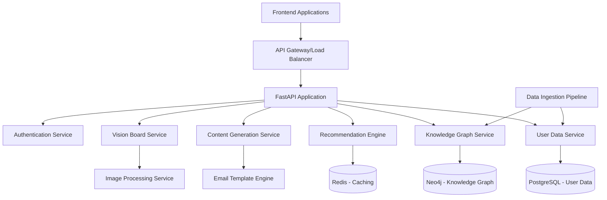

# Design Document

## Overview

The personalized marketing backend is a Python-based system that leverages knowledge graphs and machine learning to generate personalized marketing content. The system consists of a data ingestion layer, knowledge graph engine, recommendation service, content generation service, and RESTful API layer. The architecture is designed to be scalable, maintainable, and easily integrable with frontend applications.

## Architecture

### High-Level Architecture



### Technology Stack

- **Web Framework**: FastAPI for high-performance async API development
- **Knowledge Graph**: Neo4j for storing and querying complex relationships
- **Primary Database**: PostgreSQL for structured user and transaction data
- **Caching**: Redis for session management and query result caching
- **ML/Recommendations**: scikit-learn, pandas for data analysis and recommendations
- **Image Processing**: Pillow, OpenCV for vision board generation
- **Template Engine**: Jinja2 for email template rendering
- **Containerization**: Docker and Docker Compose for deployment
- **API Documentation**: Automatic OpenAPI/Swagger documentation via FastAPI

## Components and Interfaces

### 1. API Layer (FastAPI)

**Endpoints:**
- `POST /api/v1/users/{user_id}/data` - Ingest user purchase and interest data
- `GET /api/v1/users/{user_id}/recommendations` - Get personalized recommendations
- `POST /api/v1/users/{user_id}/email` - Generate personalized marketing email
- `GET /api/v1/users/{user_id}/vision-board` - Generate and retrieve vision board
- `GET /api/v1/health` - Health check endpoint
- `GET /api/v1/metrics` - System metrics for monitoring

**Authentication:**
- JWT-based authentication with configurable token expiration
- API key authentication for service-to-service communication
- Rate limiting per user/API key

### 2. User Data Service

**Responsibilities:**
- Store and manage user profiles, purchase history, and interests
- Validate and normalize incoming data
- Provide data access layer for other services

**Database Schema (PostgreSQL):**
```sql
-- Users table
users (id, email, created_at, updated_at, profile_data)

-- Purchases table  
purchases (id, user_id, product_id, amount, category, timestamp, metadata)

-- User interests table
user_interests (id, user_id, interest_category, interest_value, confidence_score, source)

-- Products table
products (id, name, category, price, description, image_url, metadata)
```

### 3. Knowledge Graph Service

**Graph Schema (Neo4j):**
- **User Nodes**: Properties include demographics, behavior patterns, preference scores
- **Product Nodes**: Properties include category, price range, features, popularity
- **Interest Nodes**: Categories and subcategories of user interests
- **Relationships**: 
  - `PURCHASED` (User -> Product) with properties: timestamp, satisfaction_score
  - `INTERESTED_IN` (User -> Interest) with properties: strength, source
  - `SIMILAR_TO` (User -> User) with properties: similarity_score, common_interests
  - `BELONGS_TO` (Product -> Category) with properties: relevance_score
  - `COMPLEMENTS` (Product -> Product) with properties: co_purchase_frequency

**Query Interface:**
```python
class KnowledgeGraphService:
    def add_user_purchase(self, user_id: str, product_id: str, metadata: dict)
    def find_similar_users(self, user_id: str, limit: int = 10) -> List[dict]
    def get_product_recommendations(self, user_id: str, limit: int = 20) -> List[dict]
    def update_user_interests(self, user_id: str, interests: List[dict])
    def get_user_profile_graph(self, user_id: str) -> dict
```

### 4. Recommendation Engine

**Algorithm Components:**
- **Collaborative Filtering**: Find users with similar purchase patterns
- **Content-Based Filtering**: Recommend products similar to user's purchase history
- **Graph-Based Recommendations**: Leverage knowledge graph relationships
- **Hybrid Approach**: Combine multiple recommendation strategies

**Recommendation Types:**
- Product recommendations based on purchase history
- Interest-based content suggestions
- Trending products in user's categories
- Cross-category recommendations for discovery

### 5. Content Generation Service

**Email Generation:**
- Template-based system with dynamic content insertion
- Personalization based on user name, interests, and recommendations
- A/B testing support for different email formats
- HTML and plain text versions

**Template Structure:**
```python
class EmailTemplate:
    subject_template: str
    html_template: str
    text_template: str
    personalization_fields: List[str]
    
class EmailGenerator:
    def generate_email(self, user_id: str, template_id: str) -> EmailContent
    def get_personalization_data(self, user_id: str) -> dict
```

### 6. Vision Board Service

**Components:**
- Image collection and processing
- Layout generation algorithms
- Text overlay and styling
- Export in multiple formats (JSON for web, PNG for sharing)

**Vision Board Structure:**
```python
class VisionBoard:
    user_id: str
    layout: dict  # Grid layout configuration
    sections: List[VisionBoardSection]
    theme: dict  # Color scheme, fonts, styling
    
class VisionBoardSection:
    type: str  # "product", "interest", "inspiration"
    content: dict  # Images, text, metadata
    position: dict  # x, y, width, height
```

## Data Models

### Core Data Models

```python
from pydantic import BaseModel
from typing import List, Optional, Dict
from datetime import datetime

class User(BaseModel):
    id: str
    email: str
    profile_data: Dict
    created_at: datetime
    updated_at: datetime

class Purchase(BaseModel):
    id: str
    user_id: str
    product_id: str
    amount: float
    category: str
    timestamp: datetime
    metadata: Optional[Dict] = {}

class UserInterest(BaseModel):
    user_id: str
    interest_category: str
    interest_value: str
    confidence_score: float
    source: str

class Product(BaseModel):
    id: str
    name: str
    category: str
    price: float
    description: str
    image_url: Optional[str]
    metadata: Dict

class Recommendation(BaseModel):
    product_id: str
    score: float
    reason: str
    category: str

class EmailContent(BaseModel):
    subject: str
    html_content: str
    text_content: str
    personalization_data: Dict

class VisionBoardResponse(BaseModel):
    user_id: str
    board_data: Dict
    image_url: Optional[str]
    generated_at: datetime
```

## Error Handling

### Error Categories and Responses

1. **Validation Errors (400)**
   - Invalid user data format
   - Missing required fields
   - Data type mismatches

2. **Authentication Errors (401/403)**
   - Invalid JWT tokens
   - Expired authentication
   - Insufficient permissions

3. **Resource Errors (404)**
   - User not found
   - Product not found
   - Template not found

4. **Service Errors (500)**
   - Database connection failures
   - Knowledge graph query failures
   - External service timeouts

5. **Rate Limiting (429)**
   - Too many requests per time window
   - API quota exceeded

### Error Response Format

```python
class ErrorResponse(BaseModel):
    error_code: str
    message: str
    details: Optional[Dict] = {}
    timestamp: datetime
    request_id: str
```

### Logging Strategy

- Structured logging with JSON format
- Log levels: DEBUG, INFO, WARNING, ERROR, CRITICAL
- Request tracing with correlation IDs
- Performance metrics logging
- Security event logging

## Testing Strategy

### Unit Testing
- Test coverage target: 90%+
- Mock external dependencies (databases, APIs)
- Test all service methods and API endpoints
- Property-based testing for data validation

### Integration Testing
- Database integration tests with test containers
- Knowledge graph query testing
- API endpoint integration tests
- Email generation end-to-end tests

### Performance Testing
- Load testing for API endpoints
- Knowledge graph query performance benchmarks
- Recommendation engine latency testing
- Vision board generation performance tests

### Test Data Management
- Synthetic test data generation
- Data anonymization for testing
- Test database seeding and cleanup
- Mock data for development environments

### Testing Tools
- **pytest** for unit and integration testing
- **pytest-asyncio** for async test support
- **testcontainers** for database integration tests
- **locust** for load testing
- **factory_boy** for test data generation